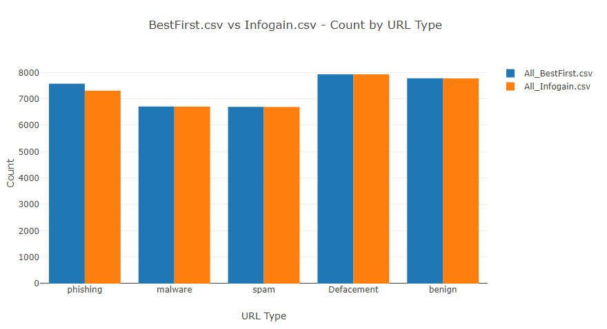

# URL Classification with ML .NET in F#

## Navigation

1. [Code](./URLClassificationModel/)
2. [Output](./output/)

## Overview
This project uses the [ISCX-URL2016 URL dataset](https://www.unb.ca/cic/datasets/url-2016.html) and [ML .NET](https://dotnet.microsoft.com/apps/machinelearning-ai/ml-dotnet) in F# to evaluate 5 different machine learning algorithms performance at training a multiclass classification model. These algorithms include: 

- [LightGbmMulticlassTrainer](https://docs.microsoft.com/en-us/dotnet/api/microsoft.ml.trainers.lightgbm.lightgbmmulticlasstrainer?view=ml-dotnet)
- [SdcaMaximumEntropyMulticlassTrainer](https://docs.microsoft.com/en-us/dotnet/api/microsoft.ml.trainers.sdcamaximumentropymulticlasstrainer?view=ml-dotnet)
- [SdcaNonCalibratedMulticlassTrainer](https://docs.microsoft.com/en-us/dotnet/api/microsoft.ml.trainers.sdcanoncalibratedmulticlasstrainer?view=ml-dotnet)
- [LbfgsMaximumEntropyMulticlassTrainer](https://docs.microsoft.com/en-us/dotnet/api/microsoft.ml.trainers.lbfgsmaximumentropymulticlasstrainer?view=ml-dotnet)
- [NaiveBayesMulticlassTrainer](https://docs.microsoft.com/en-us/dotnet/api/microsoft.ml.trainers.naivebayesmulticlasstrainer?view=ml-dotnet)

Each URL is classified into one of the following categories:
- Benign
- Defacement
- Spam
- Phishing
- malware

with every row having a series of features derived from lexical analysis on the URL. The original datasets authors include a file that contains 77 of these features but for the purposes of the project we will be using two condensed files also included in the dataset.

First is the "All_BestFirst.csv" which is a truncated version of the original dataset that contains the best features from their binary classification model training and evaluation. It has the following features:

[|"domain_token_count"; "executable"; "NumberofDotsinURL";
  "Arguments_LongestWordLength"; "NumberRate_Domain"; "NumberRate_FileName";
  "NumberRate_AfterPath"; "Entropy_Domain"; "class"|]

 

Secondly, is the "All_Infogain.csv" which is also a shortened version of the original dataset but the features were selected from the original authors running a ranking algorithm to determine the best features for multiclass classification. This dataset contains the following features:

[|"avgpathtokenlen"; "pathurlRatio"; "ArgUrlRatio"; "argDomanRatio";
  "domainUrlRatio"; "pathDomainRatio"; "argPathRatio"; "CharacterContinuityRate";
  "NumberRate_URL"; "NumberRate_FileName"; "NumberRate_AfterPath";
  "Entropy_Domain"; "class"|]

Both datasets are equally weighted as seen in part of the visualization output:
 

  

## Methodology

The [Code](./URLClassificationModel/) is broken up into 3 F# script files. Visualization and one for each data set. The visualization script uses  [F# CSV Type Provider](http://fsprojects.github.io/FSharp.Data/library/CsvProvider.html) to create a type for the data objects which is then easily manipulated and passed to [XPlot Plotly](https://fslab.org/XPlot/plotly.html) to create an interactive html output with a pie char for each dataset and a bar chart as seen above comparing the two.

Next for each of the dataset files, the data is first modeled with a type by loading each column of the respective features. Afterwards the data is split into 80% training and 20% testing. The training data is preprocessed (performing One Hot encoding, normalization, etc.), the respective algorithm / trainer is applied, and finally the data is post processed.

Once each model corresponding to its respective algorithm is trained. It in then evaluated using the native ML .NET evaluation metrics. Furthermore the confusion matrix is printed for each. See [Output](./output/) for the console logged information.

Lastly, there is commented out code showing how to create a prediction engine for future work, such as hosting the model on a server.

## Results
For the full output and visualization see the aforementioned [Output](./output/) section of the repository. 

The results show that the Light Gradient Boosted Machine trainer / algorithm performed the best using the All_Infogain.csv dataset. These results were expected as tree algorithm are more resource intensive but usually have higher accuracy. Furthermore the dataset that has features ranked for multiclass classification expectedly performed better.

See the confusion table below for the best performing algorithm and dataset (LightGbm & All_Infogain.csv)

<pre>
LightGbm:  Log Loss: 0.143149  Log Loss Reduction: 0.910920  MacroAccuracy: 0.961894  MicroAccuracy 0.962968

Algorithm:       LightGbmMetrics
 "
Confusion table
              ||========================================
PREDICTED     ||     0 |     1 |     2 |     3 |     4 | Recall
TRUTH         ||========================================
0.   phishing || 1,295 |    57 |    29 |    20 |    18 | 0.9126
1.     benign ||    11 | 1,569 |     2 |    10 |     0 | 0.9856
2. Defacement ||    29 |     0 | 1,553 |     3 |     1 | 0.9792
3.    malware ||    40 |    12 |     9 | 1,265 |     3 | 0.9518
4.       spam ||    19 |     3 |     6 |     0 | 1,391 | 0.9803
              ||========================================
Precision     ||0.9290 |0.9561 |0.9712 |0.9746 |0.9844 |
"
</pre>

## Setup and Installation

Download [Visual Studio](https://visualstudio.microsoft.com/downloads/) and the repository code. Open up the solution (URLClassificationModel.sln) in Visual Studio and run it. This will not only automatically fetch needed NuGet Dependencies but will also run the code. That's it!

Optionally, you can install [Visual Studio Code](https://code.visualstudio.com/) and the [Ionide](https://ionide.io/) extension but it is not recommended for this project.

## References:

- [Dataset](https://www.unb.ca/cic/datasets/url-2016.html)
- [Dataset Paper](https://www.researchgate.net/publication/308365207_Detecting_Malicious_URLs_Using_Lexical_Analysis)
- [ML .NET Algorithm / Trainers](https://docs.microsoft.com/en-us/dotnet/machine-learning/how-to-choose-an-ml-net-algorithm)
- [ML .NET Metric Definitions](https://docs.microsoft.com/en-us/dotnet/machine-learning/resources/metrics )
- [ML .NET Confusion Matrix Class Definition](https://docs.microsoft.com/en-us/dotnet/api/microsoft.ml.data.confusionmatrix?view=ml-dotnet)
- [Precision and Recall Definitions](https://developers.google.com/machine-learning/crash-course/classification/precision-and-recall)
- [Microsoft ML. Net Tutorial (C#)](https://docs.microsoft.com/en-us/dotnet/machine-learning/tutorials/github-issue-classification)
- [F# ML .NET Tutorial 1](https://www.codesuji.com/2018/06/23/F-and-MLNet-Classification/)
- [F# ML .NET Tutorial 2](https://medium.com/machinelearningadvantage/use-f-and-ml-net-machine-learning-to-predict-taxi-fares-in-new-york-bdc8b5176d36 )
- [F# ML .NET Tutorial 3](https://www.luisquintanilla.me/posts/categorize-web-links-ml-net-fsharp-fsadvent2019.html )
- [F# ML .NET Tutorial 4](https://www.codesuji.com/2019/09/14/F-and-MLNet-Regression-V2/ )
- [F# CSV Type Provider](http://fsprojects.github.io/FSharp.Data/library/CsvProvider.html)
- [F# Plotting/Graphing](https://fslab.org/XPlot/)